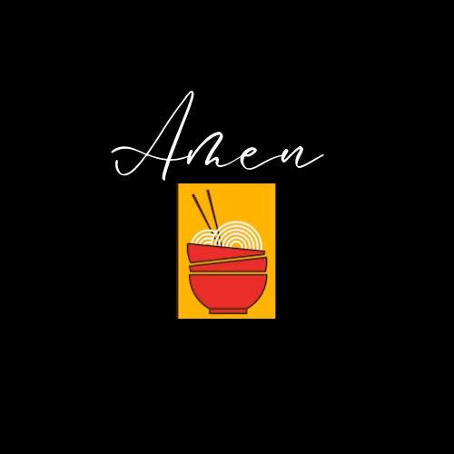

# Amen Ramen - Aplicación de Pedido de Ramen a Domicilio

¡Bienvenido a Amen Ramen! Esta es una aplicación web diseñada para permitir a los usuarios ordenar deliciosos platos de ramen desde la comodidad de sus hogares. Con Amen Ramen, puedes explorar una variedad de opciones de ramen, agregar tus platos favoritos al carrito y realizar pedidos de manera rápida y sencilla.

  

## Características Principales

- **Exploración de Menú:** Explora una amplia selección de platos de ramen, cada uno con su descripción, imagen y precio.
- **Añadir al Carrito:** Agrega tus platos favoritos al carrito de compras con solo un clic.
- **Gestión de Pedidos:** Revisa tu pedido en el carrito, ajusta las cantidades o elimina elementos según sea necesario.
- **Pedido a Domicilio:** Realiza pedidos y especifica la dirección de entrega para recibir tu ramen en la puerta de tu casa.
- **Interfaz Responsiva:** Disfruta de una experiencia de usuario fluida en dispositivos móviles, tablets y ordenadores de escritorio.

## Tecnologías Utilizadas

- **React&Vite:** Biblioteca de JavaScript para construir interfaces de usuario interactivas.
- **Tailwind CSS:** Framework de diseño CSS utilitario para crear interfaces de usuario modernas y receptivas.
- **React Icons:** Biblioteca de iconos para React, que proporciona una amplia gama de iconos para utilizar en la interfaz de usuario.
- **JSON Server:** Herramienta para crear una API RESTful simulada a partir de un archivo JSON, utilizado para simular datos de menú de ramen.

## Instalación

1. Clona este repositorio.
2. Navega hasta el directorio del proyecto en tu terminal.
3. Ejecuta `npm install` para instalar las dependencias del proyecto.
4. Ejecuta `npm start` para iniciar la aplicación en tu navegador.

## Estructura del Proyecto

El proyecto sigue una estructura de directorios típica de una aplicación React:

- **amen-ramen/**
  - **public/**: Archivos estáticos y HTML principal
  - **src/**: Código fuente de la aplicación
    - **components/**: Componentes React de la aplicación
    - **data/**: Archivos JSON que contienen datos de menú simulados
    - **styles/**: Estilos globales y configuración de Tailwind CSS
    - **App.js**: Archivo principal de la aplicación
  - **package.json**: Archivo de configuración de npm con las dependencias del proyecto
  - **README.md**: Documentación del proyecto (este archivo)

¡Las contribuciones son bienvenidas! Si encuentras algún error, tienes alguna idea para mejorar la aplicación o quieres añadir nuevas características, no dudes en abrir un issue o enviar un pull request.

## Licencia

Este proyecto está bajo la [Licencia MIT](LICENSE).

